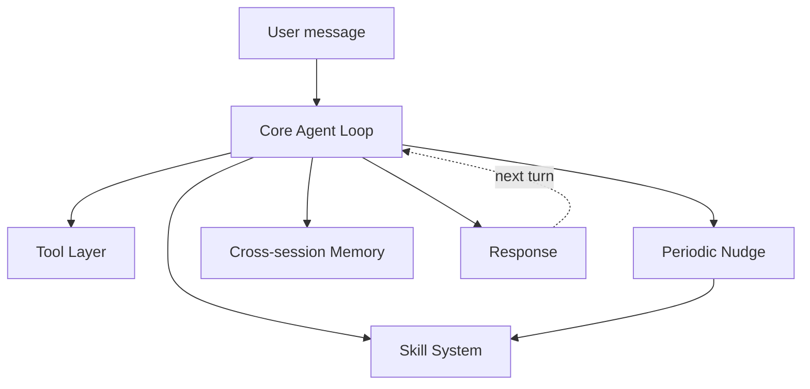

# Mini-Hermes — Architecture & Decisions

A small self-improving agent, built one atomic piece at a time. This doc tracks what's built and *why* — updated as the build progresses.

## System overview (target, not yet built)



## Roadmap

| Step | Piece | Status |
|---|---|---|
| 1 | Core Agent Loop (message history, tool schema, tool-call parsing, execution, stop-condition — no wrapper) | 🔨 Design locked, implementation pending |
| 2 | Tool Layer (small real tool set) | ⏳ Pending |
| 3 | Skill System (Markdown files, description-routed retrieval, `skill_manage`) | ⏳ Pending |
| 4 | Periodic Nudge (self-review at intervals, decides what's worth persisting) | ⏳ Pending |
| 5 | Cross-session Memory (SQLite, salvaged pattern from Billie's storage foundation) | ⏳ Pending |
| 6 | CLI Interface (interactive chat loop) | ⏳ Pending |

## Explicit backlog (not V1)

Multi-provider abstraction · Messaging gateways (Telegram/Slack/etc.) · Sandboxed execution (Docker) · Subagents/parallel workstreams · FTS5 full-text search.

---

*Each step below gets filled in with Theory → Design → Product+Cost → Implementation as it's built.*

## Step 1 — Core Agent Loop

**Theory and full architecture decisions:** see `DECISIONS.md`, entry dated 2026-10-04.

**Pseudocode (the actual shape of `agent_loop.py`):**

```
function agent_loop(user_message, tools, system_prompt, max_iterations=15):

    messages = [
        {"role": "system", "content": system_prompt},
        {"role": "user", "content": user_message}
    ]

    for i in range(max_iterations):
        response = call_llm_api(messages, tools)

        if response has tool_calls:
            messages.append(response.message)
            for each tool_call in response.tool_calls:
                result = dispatch_tool(tool_call.name, tool_call.arguments)
                messages.append({
                    "role": "tool",
                    "tool_call_id": tool_call.id,
                    "content": result
                })
        else:
            return response.message.content

    return "Error: max iterations reached without completing the task."
```

**Status:** Architecture fully decided. Code not yet written — next step is `config.py`, then `agent_loop.py`, each built and isolation-tested before moving on.